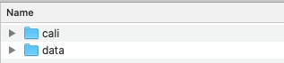
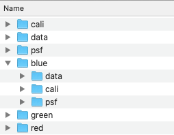
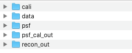
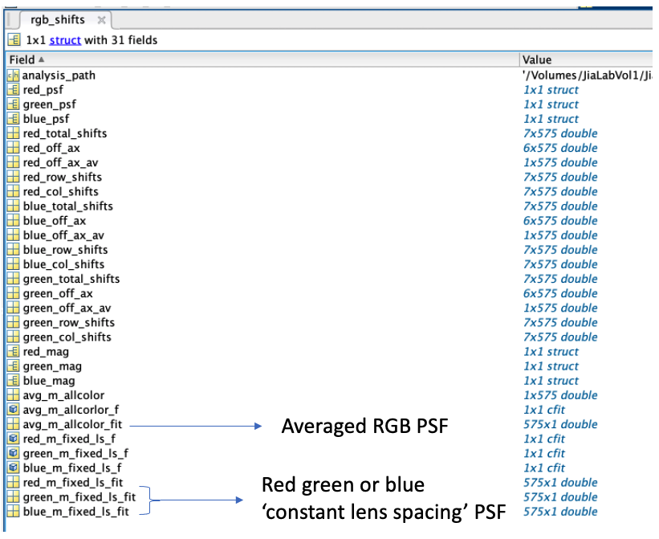

# Running Data

In the current version of this code, each RGB channel reconstruction is run separately and then they are fused.
Input data:



The "data" folder contains the tiff file to be reconstructed. The "cali" folder contains a calibration image taken of a white sheet of paper. This calibration image is used to locate each lens.

Run the `color_split.m` function:

```matlab
 color_split('./Example_Input')
```

This must be run for each folder. Sample code for running this is `run_color_split.m`

```matlab
your_path = '' % path to code folder

% Split the data
color_split([your_path filesep 'EndoscopeCode' filesep 'Example_Input' filesep 'data'])

% Split the calibration file
color_split([your_path filesep 'EndoscopeCode' filesep 'Example_Input' filesep 'cali'])

% Split the PSF
color_split([your_path filesep 'EndoscopeCode' filesep 'Example_Input' filesep 'psf'])

```
Now you should have:



**Note: Before proceeding to reconstructions, you will need to carry out RGB PSF calibration (see below). If this step has been completed, you should now have the `PSF_cal_out` and `recon_out` folders in each of your RGB color channels**



Once this step has been completed, you can run all of your RGB data for each channel by setting `multiple_data` to 1.

```matlab
%% Runtime params
multiple_data = 1; % set to one and all data files in the 'data' folder will be reconstructed.
manual_data_path = 0; % sometimes having a 'data' folder is too restrictive


master_path = '/Users/taraurner/Example_Input/green/';

if manual_data_path == 1
    data_path = [''];
end        

% Make sure to set this line to 1 when calibrating the PSF, 
% and 0 after it has been done once, 
% this step takes a while depending on the size of your images and PSF stack.
image_params.PSF_cal            = 0; % if PSF calibration step needs to be carried out
```

Lastly, run `RGB_fuse.m`, inputting the paths to each color reconstruction, to fuse the reconstructions.


# RGB PSF Calibration

In order to generate a fused RGB PSF you must calibrate each color separately and then find the average PSF based on the magnification function. These steps only need to be performed once per PSF, then the RGB PSF can be used for all subsequent reconstructions.


Run `RayOptics_Main.m` for each of the three color PSFs. Make sure to enable PSF calibration and disable the multiple data parameter for this calibration step. You will likely have more than one data image you want to reconstruct. After this step is completed, return to "Running Data" above to reconstruct all the data.

```matlab
%% Runtime params
multiple_data = 0; % set to one and all data files in the 'data' folder will be reconstructed.
manual_data_path = 0; % sometimes having a 'data' folder is too restrictive


master_path = '/Users/taraurner/Example_Input/green/';

if manual_data_path == 1
    data_path = [''];
end        
% Make sure to set this line to 1 when calibrating the PSF, and 0 after it has been done once, this step takes a while depending on the size of your images and PSF stack.
image_params.PSF_cal            = 1; 
```
You should now have this for each color folder:


Next run `RGB_PSF.m`, providing the paths to each color psf, to find the average RGB_PSF.
 


Lastly,`rgb_fuse.m` can be run to fuse the 3 color reconstruction. The RGB PSF generated in the previous step can be used to determine pixel size/FOV/resolution etc of the final dataset.

## Troubleshooting RGB PSF Calibration
- The automatic lens detection sometimes selects slightly different regions in R/G/B calibration images. This will cause problems with image fusion. To avoid this, you can use the best SNR calibration image to calibrate all three PSFs, ensuring that your reconstructions are using the same camera pixel for each color.
- Depending on the spectrum of the source you use and the sensitivity of the camera, some channels of the RGB PSF may be dimmer than others and hard for the algorithm to track. If you are seeing "jumps" in your PSF, you can add the `positionsxy.mat` structure output from a higher SNR channel to a new folder named `psf_cal_in` in the parent folder of your low SNR data. Then enable `image_params.PSF_cal_in` in `RayOptics_Main.m` when you run psf calibration on the low SNR channel. This will enable an optional step where the code uses the better SNR PSF as a fidiculial marker around which to search for localizing the low SNR psf.
